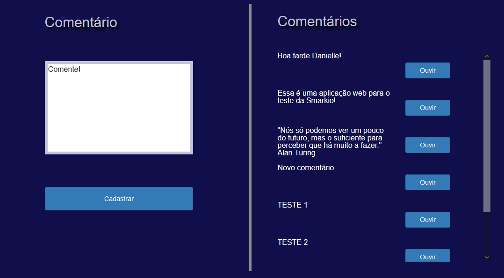
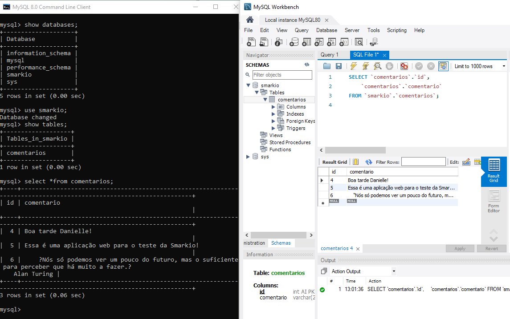

<!-- PROJECT LOGO -->
<br />
<h1 align="center">
    <br>
</h1>
<hr>
  <h1 align="center">Teste Smarkio-IBM-TTS</h1>
  <p align="center">
    Aplicação WEB em Node.js com banco de dados MySQL que converte comentário de texto para áudio com a API Text to Speech do IBM Watson.
</p>


## :white_check_mark: Tecnologias utilizadas

- [Bootstrap](https://getbootstrap.com)
- [PUG](https://pugjs.org/language/code.html)
- [JQuery](https://jquery.com)
- [Node.js](https://nodejs.org/en/)
- [Express](https://expressjs.com/pt-br/)
- [Node/Express](https://developer.mozilla.org/en-US/docs/Learn/Server-side/Express_Nodejs/Introduction)
- [IBM TTS Watson](https://cloud.ibm.com/apidocs/text-to-speech)
- [MySQL](https://www.mysql.com/)


### :pushpin: Pré - requisitos

Antes de começar, é necessário já ter instalado em sua máquina o seguinte:

* [MySQL](https://www.mysql.com/)
* [Node.js](https://nodejs.org/en/)
* [Git](https://git-scm.com)
* IDE (recomendo o [VSCode](https://code.visualstudio.com/))

### :pushpin: Clone este repositório

1. Execute o seguinte comando:

```sh
$ git clone https://github.com/DanielleSM/Smarkio-IBM.git
```

### :pushpin: Configurando o Banco de Dados

1. No arquivo **/config/database-config.js** é possivel alterar as configurações de conexão ao banco. Inclua seu username e senha de login do MySQL.

``` JS
module.exports = {
    username: 'nome do usuário',
    password: 'senha do banco',
    database: 'nome do banco',
    host: 'nome do servidor',
    dialect: 'mysql',
  }

```
2. Caso ainda não tenha criado o banco, execute o seguinte comando no terminal para criá-lo.
``` sh
$ node createDB.js
  
```

3. Para corrigir o erro "sqlMessage: 'Client does not support authentication protocol requested by server; ", execute no seu terminal do MySQL o seguinte comando:

``` sh
ALTER USER 'root'@'localhost' IDENTIFIED BY 'password'; 
ALTER USER 'root'@'localhost' IDENTIFIED WITH mysql_native_password BY 'password';
  }
```
**Onde root é seu usuario, localhost seu host e password a sua senha.**

### :sound: Configurando a API TTS

1. Caso quiser usar sua própria API key, acesse [IBM Cloud TTS](https://cloud.ibm.com/catalog/services/text-to-speech) e inscreva-se para obter uma conta gratuita do IBM Cloud ou efetue login.
2. Clique em **Criar**.
3. Na Lista de recursos do IBM Cloud, clique em sua instância de serviço do Text to Speech e acesse a página do painel de serviço do Text to Speech.
4. Na página **Gerenciar**, clique em Mostrar credenciais para visualizar suas credenciais.
5. Copie os valores de **API Key** e **URL**.
6. No arquivo **/config/api-config.js** é possivel alterar as credenciais da API.

``` JS
var config = {};
config.apikey = "your-API key";
config.ibmUrl = "your-URL";
config.voice="pt-BR_IsabelaVoice";
module.exports = config;
```

### :computer: Instalando e executando


1. Navegue no terminal até a pasta principal do projeto e em seguinda execute o servidor.

```sh
$ cd 'nomedapasta'
$ npm start
```
OBS.: Devido a erro na instalação de módulos com o comando 'npm install' em outras máquinas, foi feito o upload da pasta node.modules
nesse repositório.

2. Abra o browser http://localhost:3000/.

### :rocket: Utilizando a Aplicação WEB

1. Escreva algum comentário na caixa de texto.
 
2. Clique em **Cadastrar** o comentário para salvar no banco de dados.

3. Clique em **Ouvir** para ouvir a reprodução do áudio do comentário.




## Banco de Dados após a execução

MySQL 8.0 Command Line Cliente / MySQL Workbench




## Autor
Danielle Melo :woman:
[Linkedin](https://www.linkedin.com/in/daniellemelo20/)

